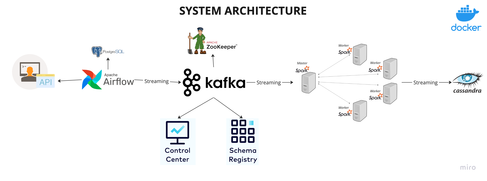

# Real-Time Data Streaming | End-to-End Data Engineering Pipeline
## Overview

This project demonstrates a fully containerized end-to-end data engineering pipeline. It covers the complete data lifecycle from ingestion to streaming, processing, and storage using modern data engineering tools.

The pipeline ingests data from an external API, orchestrates workflows with Apache Airflow, streams data using Apache Kafka, processes it with Apache Spark, and stores the final results in Cassandra.



## Technologies
- Apache Airflow
- Python
- Apache Kafka
- Apache Zookeeper
- Apache Spark
- Cassandra
- PostgreSQL
- Docker

## Getting Started
1. Navigate to the project directory:
```bash
cd e2e-data-engineering
```
2. Install Python Dependencies
```bash
pip install apache-airflow
pip install kafka-python
```
3. Download Required Spark Connectors
Download the following JARs from Maven Repository and place them in your Spark jars/ directory:

- Spark Cassandra Connector
- Spark SQL Kafka Connector

3. Run Docker Compose to spin up the service

4. Start Docker Services
```bash
docker-compose up -d
docker compose up -d control-center
```

5. Check running services:
```bash
docker compose ps
```
